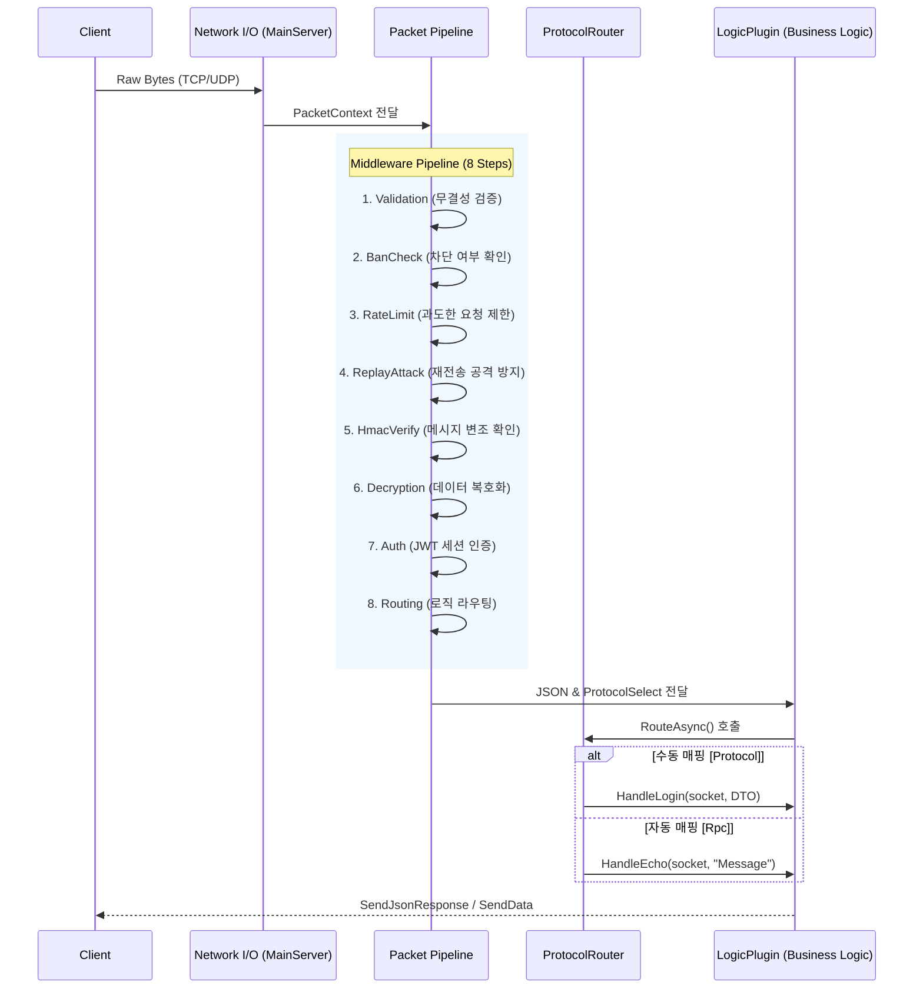

**[문서 내비게이션 바]**
**[Technical]** [Architecture](./Architecture.md) | [API Reference](./API_Reference.md) | [Setup Guide](./Setup_Guide.md) | [Database Schema](./Database_Schema.md)
**[UserGuide]** [Introduction](../UserGuide/Introduction.md) | [Installation](../UserGuide/Installation.md) | [How to Use](../UserGuide/How_to_Use.md) | [Troubleshooting](../UserGuide/Troubleshooting.md)
---

# 시스템 아키텍처 (System Architecture)

## 1. 개요
**TeruTeru Server AI Engine (v2.0)**은 고성능 비동기 I/O(IOCP) 기반의 C# 서버 엔진으로, 네트워크 통신과 AI(YOLO) 객체 탐지 로직을 통합 호스팅하기 위해 설계되었습니다. 아키텍처 현대화(Phase 2)를 거쳐 강력한 모듈화와 플러그인 핫로딩(Hot-Reloading)을 지원합니다.

## 2. 4계층 레이어드 아키텍처 (Layered Architecture)
시스템은 역할과 책임의 분리(Separation of Concerns)를 위해 4개의 핵심 계층과 1개의 플러그인 계층으로 나뉩니다.

*   **`TeruTeruServer.SDK`**: 공통 인터페이스, 통신 프로토콜 모델, AI 유틸리티, 그리고 P2P/그룹 모델을 정의하는 최하위 규약 계층입니다.
*   **`TeruTeruServer.Runtime`**: 소켓 통신(IOCP), 8단계 미들웨어 파이프라인(Validation, BanCheck, RateLimit, ReplayAttack, HmacVerify, Decryption, Auth, Routing), 그리고 세션/클러스터링 관리를 담당하는 핵심 엔진입니다.
*   **`TeruTeruServer.Commands`**: 서버 런타임 중 콘솔 입력을 통한 운영 제어 및 AI 분석 명령을 모듈화하여 처리합니다.
*   **`TeruTeruServer.Cli`**: 애플리케이션의 진입점으로 DI 구성, 구성 파일 로드, 그리고 서버 인스턴스를 호스팅합니다.
*   **`Logic.Default` (Plugin)**: 핫로딩 가능한 비즈니스 로직 계층으로, 실제 게임 규칙이나 AI 분석 흐름이 구현됩니다.

## 3. 데이터 흐름 및 파이프라인 (Data Flow & Pipeline)

네트워크 패킷이 수신되면 `PacketPipeline`을 거쳐 `LogicPlugin`으로 라우팅됩니다.

## 4. 핵심 메커니즘
*   **P2P 하이브리드 인프라**: 클라이언트 간 직접 통신(UDP Hole Punching)을 최우선으로 시도하며, NAT 환경 등의 이유로 실패할 경우 서버가 즉시 릴레이(Fallback)로 전환하여 통신 무결성을 보장합니다.
*   **플러그인 핫로딩**: `AssemblyLoadContext`를 사용하여 `plugins/` 폴더 내의 `.dll` 파일 변경을 감지하고, 메모리 누수 없이 런타임 중에 비즈니스 로직을 교체합니다.
*   **실시간 상태 동기화 (State Sync)**: Tick Loop 기반으로 게임 월드의 상태를 스냅샷으로 캡처하고, 클라이언트에게 Delta 값만 브로드캐스트하여 네트워크 대역폭을 최적화합니다.
*   **서버 클러스터링 (M12)**: 세션 저장소의 추상화(Redis-ready)를 통해 여러 서버 인스턴스가 상태를 공유하고, 부하 분산 및 수평 확장이 가능한 구조를 갖추고 있습니다.