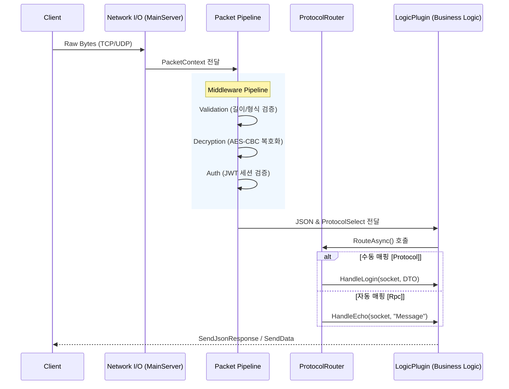

**[문서 내비게이션 바]**
**[Technical]** [Architecture](./Architecture.md) | [API Reference](./API_Reference.md) | [Setup Guide](./Setup_Guide.md) | [Database Schema](./Database_Schema.md)
**[UserGuide]** [Introduction](../UserGuide/Introduction.md) | [Installation](../UserGuide/Installation.md) | [How to Use](../UserGuide/How_to_Use.md) | [Troubleshooting](../UserGuide/Troubleshooting.md)
---

# 시스템 아키텍처 (System Architecture)

## 1. 개요
**TeruTeru Server AI Engine (v2.0)**은 고성능 비동기 I/O(IOCP) 기반의 C# 서버 엔진으로, 네트워크 통신과 AI(YOLO) 객체 탐지 로직을 통합 호스팅하기 위해 설계되었습니다. 아키텍처 현대화(Phase 2)를 거쳐 강력한 모듈화와 플러그인 핫로딩(Hot-Reloading)을 지원합니다.

## 2. 4계층 레이어드 아키텍처 (Layered Architecture)
시스템은 역할과 책임의 분리(Separation of Concerns)를 위해 4개의 핵심 계층과 1개의 플러그인 계층으로 나뉩니다.

*   **`TeruTeruServer.SDK`**: 공통 인터페이스(`IProtocolRouter`, `ILogicService`), 통신 프로토콜 모델(`RpcRequest`, `LoginProtocol`), 열거형(`ProtocolSelect`), 애트리뷰트(`[Rpc]`, `[Protocol]`)가 정의된 규약 계층입니다.
*   **`TeruTeruServer.Runtime`**: 소켓 통신(TCP/UDP), 미들웨어 파이프라인, 의존성 주입(DI), 플러그인 생명주기를 관리하는 심장부입니다.
*   **`TeruTeruServer.Commands`**: 서버 런타임 중 콘솔 입력을 통한 운영 제어(CLI Commands) 로직을 담당합니다.
*   **`TeruTeruServer.Cli`**: 애플리케이션의 진입점(`Program.cs`)으로, DI 컨테이너를 구성하고 서버 인스턴스를 호스팅합니다.
*   **`Logic.Default` (Plugin)**: 실제 비즈니스 로직이 구현되는 공간입니다. 런타임과 완전히 분리되어 작동 중에 교체(Hot-Reloading)가 가능합니다.

## 3. 데이터 흐름 및 파이프라인 (Data Flow & Pipeline)

네트워크 패킷이 수신되면 `PacketPipeline`을 거쳐 `LogicPlugin`으로 라우팅됩니다.

## 4. 동적 라우팅 및 핫로딩 메커니즘
*   **플러그인 핫로딩**: `AssemblyLoadContext`를 사용하여 `plugins/` 폴더 내의 `.dll` 파일 변경을 감지(`FileSystemWatcher`)하고, 메모리 누수 없이 기존 로직을 새 로직으로 교체합니다.
*   **리플렉션 기반 라우팅**: `ProtocolRouter`는 초기화 시 `LogicPlugin`의 메서드를 리플렉션으로 분석하여 `[Protocol]`(열거형 수동 매핑)과 `[Rpc]`(문자열 자동 매핑) 라우팅 테이블을 메모리에 캐싱합니다. 이를 통해 O(1)의 속도로 패킷을 올바른 핸들러로 분기합니다.